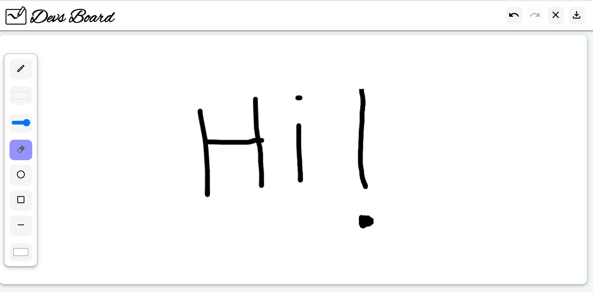

### This repository ✉ contains the  *Devsnest 40-hours Hackathon Project* 🚀DevsBoard;

> Currently, The project has tools like
1. Pen Tool
2. Eraser Tool
3. Pen Stroke Size Adjust Tool
4. Pen Color  Change Tool
5. Board Color change
6. Undo button
7. Redo Button
8. Clear Page Button
9. Save Tool

> Hackathon was a great learning Experience , where I worked first time on canvas .

` You may want to Star or Create a Issue ✍ for projects to improve the project⚡ .`

#[**DevsBoard** ](https://devsboard.netlify.app)💭
   ***
   
