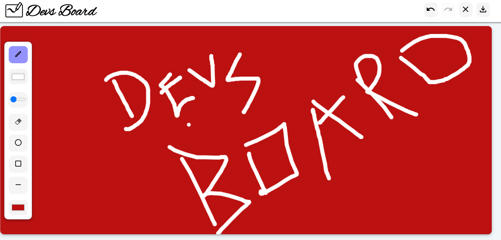

### This repository ✉ contains the  *Devsnest 40-hours Hackathon Project* 🚀DevsBoard;
## [**DevsBoard** ](https://devsboard.netlify.app)💭
> Currently, The project has tools like
1. Pen Tool
2. Eraser Tool
3. Pen Stroke Size Adjust Tool
4. Pen Color  Change Tool
5. Board Color change
6. Undo button
7. Redo Button
8. Clear Page Button
9. Save Tool
10. Tool tip on hover

> Hackathon was a great apprenticeship experience, where I worked for the first time on canvas .

` You may want to Star or Create a Issue ✍ for projects to improve the project⚡ .`

   
   
